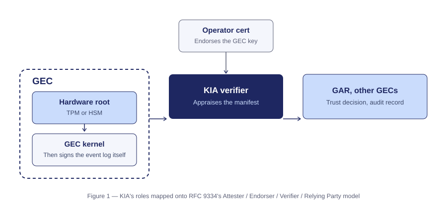
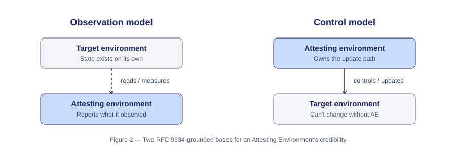
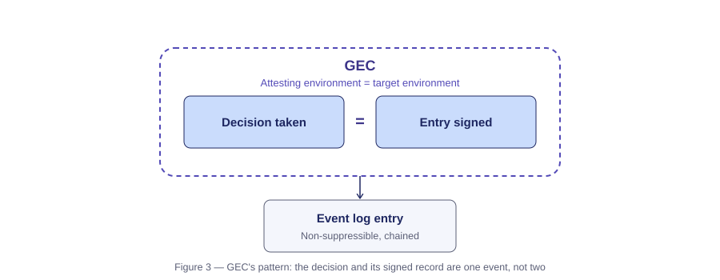
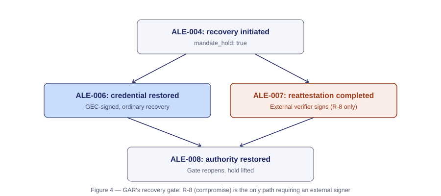

# KIA and GAR Against the RATS Architecture: A Checklist

*A working reference for RATS-familiar readers evaluating KIA and GAR, and for SOOS implementers who
want the RFC 9334 grounding behind each design decision.*

---

## Why this document exists

RFC 9334 (the RATS Architecture) is built around a fairly small set of core concepts — Evidence,
Attestation Results, Endorsement, Attesting/Target Environment, Reference Value, Layered Attestation,
Appraisal Policy, Freshness, and the Passport/Background-Check conveyance models. Anyone evaluating a
new attestation profile against that architecture tends to walk through the same list, one term at a
time: does this profile have a real answer for Evidence? For Reference Values? For freshness?

This document works through that list explicitly for KIA (`draft-sato-soos-kia`) and GAR
(`draft-sato-soos-gar`), citing the specific normative text behind each answer rather than describing
the intent in the abstract. Where an honest answer is "this isn't fully specified yet," it says so —
a checklist that only shows the easy answers isn't a useful one.

---

## 1. The role model

KIA declares the Governing Enforcement Component (GEC) — the enforcement kernel at the center of the
SOOS governance architecture — as a RATS Attester under RFC 9334, with a complete mapping to every RATS
role:

| RATS role | KIA / SOOS equivalent |
| --- | --- |
| Attester | The GEC instance, via the KIA subsystem |
| Evidence | The GEC Manifest |
| Endorser | The operator root keypair holder |
| Endorsement | The GEC Attestation Certificate |
| Verifier | Inline by the Relying Party (standard deployments); a separate KIA Verification Service (high-assurance deployments) |
| Relying Party | Agents submitting mandates; external audit consumers; federated kernel instances |
| Reference Values | The SOOS KernelSpec conformance version string; expected `cedar_policy_set_hashes[]` per deployment |

Two things worth flagging up front, since they recur through the rest of this document: a separate
Verifier service is *optional* in the standard deployment model — Relying Parties can verify the GEC
Manifest inline against the operator-provisioned public key — and becomes *mandatory* for exactly one
scenario, covered in Section 6.

## 2. What gives an Attesting Environment its credibility

RFC 9334 describes Attesting Environments as collecting Claims "by reading system registers and
variables, calling into subsystems, and taking measurements on code, memory, or other relevant assets
of the Target Environment" — an **observation** model. A second pattern, not named in RFC 9334 itself
but implicit in TCG's DICE layering and Root-of-Trust-for-Update thinking, is **control**: an Attesting
Environment that owns the update path into a Target Environment, and is therefore credible because
nothing can change without going through it.

Both patterns share a structural feature: the Attesting Environment and the Target Environment are two
distinct things, and the fact being attested exists independently of the act of attesting to it.

**GEC fits neither pattern exactly.** RFC 9334 explicitly allows "the Attesting and Target Environments
[to be] combined into one environment" — the closest existing hook — but even that collapsed case
usually still assumes the entity is measuring its own pre-existing state (its own firmware version, say).
GEC's Event Log entries are different: the governed decision and its signed record come into existence
*together*, because a `kernel.transition()` call only happens through the GEC in the first place. There
is no separate fact for the GEC to observe or control — the signing act and the occurrence are the same
event.

This matters beyond terminology. RFC 9334's own Security Considerations flag the collapsed AE/TE case
directly: *"Implementers need to evaluate their designs to ensure that the assumed security properties
of the individual components and roles still hold despite the lack of separation and that emergent risk
is not introduced... Isolation mechanisms in software or hardware that separate Attesting Environments
and Target Environments can support an implementer's evaluation."* GEC's fusion of its decision engine
(CAP, the Constitutional AI Protocol) and its record-keeping function is a specific instance of exactly
this named risk. Section 6 covers KIA's compensating control for it.

## 3. Reference Values

KIA's Reference Values are concrete and narrow: a KernelSpec conformance version string, plus expected
`cedar_policy_set_hashes[]` per deployment. A Verifier is not comparing individual governance decisions
against a golden value — it's comparing a hash of the GEC's *active policy configuration* against the
expected one, structurally identical to a firmware-hash comparison, just hashing policy instead of
firmware.

Whether any individual decision was the correct application of that policy is decided by CAP inside the
Attester, at the moment the decision is signed — not re-derived by the Verifier afterward. This is a
deliberate boundary: RATS' own charter excludes appraisal-policy formats from its scope, and KIA doesn't
need one, because by the time Evidence exists, policy has already been applied. The Reference Value only
confirms it was the *right* policy set doing the applying.

## 4. Layered and composite attestation

KIA's trust chain — hardware root, to operator-signed GEC Attestation Certificate, to GEC Manifest, to
signed Event Log entries — is a direct instance of RFC 9334's layered attestation model, where an
appraised Target Environment becomes the next layer's Attesting Environment. The vocabulary for
describing *how* multiple Attesters compose (Lead Attesting Environment, Component Attesting
Environment, and so on) comes from the composite-attesters taxonomy, which has since moved from an
Internet-Draft to the RATS wiki — worth citing as a wiki reference rather than a stale I-D.

## 5. Appraisal policy: two different questions

RFC 9334 distinguishes appraisal policy for Evidence (used by a Verifier to produce an Attestation
Result) from appraisal policy for Attestation Results (used by a Relying Party to decide whether to act
on one). Section 3 above covers the first half for KIA. The second half — how a Relying Party should
weigh a KIA Attestation Result once produced — is not yet specified as its own normative treatment in
either draft. Different Relying Parties (an agent's own kernel, an external auditor, a federated peer
instance) plausibly have different risk tolerances here, and that gap is open rather than resolved.

## 6. Freshness, and the honest gap

RFC 9334 treats freshness as a first-class concept (its own glossary entry, alongside "epoch" and
"recentness"), typically achieved through a nonce or challenge-response binding that proves Evidence was
generated in response to a specific request, not merely generated recently.

KIA-07's current freshness mechanism is narrower: `attestation_timestamp` is checked against a maximum
staleness window (86,400 seconds / 24 hours in the reference implementation, per Section 5.4). This is a
plain recency check, not a nonce-bound freshness proof. It does not, on its own, rule out replay of a
captured-but-still-within-window GEC Manifest. This is a genuine open item for KIA's normative text, not
a documentation gap — worth treating as such in any implementation that has a low tolerance for replay
risk within that window.

## 7. Conveyance: Passport or Background-Check?

RFC 9334 names two canonical conveyance shapes. In the Passport Model, the Attester delivers Evidence
directly to a Verifier and carries the resulting Attestation Result itself, presenting it to Relying
Parties as needed. In the Background-Check Model, the Attester delivers Evidence to a Relying Party,
which forwards it to a separate Verifier and receives the Attestation Result back.

KIA's two deployment modes map onto these, though the drafts don't yet name them explicitly this way:
standard deployments, where a Relying Party verifies the GEC Manifest inline, are closest to a collapsed
variant where the Relying Party takes on the Verifier role directly. High-assurance deployments, with a
separate KIA Verification Service, are closer to genuine Background-Check.

## 8. The compromise-recovery case (R-8)

This is where KIA's answer to Section 2's "lack of separation" risk actually shows up. GAR's Authority
Lifecycle Event (ALE) system tracks a full lifecycle for revoking and restoring an agent's authority.
For most revocation classes (R-1 through R-7), recovery is GEC-signed like any other event. For R-8
specifically — compromise — one event in that lifecycle, `ALE-007` (`ALE_KIA_REATTESTATION_COMPLETED`),
**must** be signed by an external KIA Verification Service instead of the GEC itself, because a
compromised kernel cannot self-attest its own recovery.

That one record does more than swap the signer. It establishes a genuinely new attestation identity
(`prior_attestation_id` differs from `new_attestation_id` — continuing to trust the old key isn't
sufficient after a compromise), re-checks the Reference Values from outside (`new_cedar_policy_hash`,
`new_kernel_version`), and records exactly how long the compromise window was (`attestation_gap_duration`)
along with every session that ran during it (`sessions_during_gap[]`). Those sessions are not
automatically invalidated — a named principle ("horizontal non-contamination") prevents one compromised
window from retroactively poisoning unrelated concurrent sessions — but they must carry an
`ATTESTATION_GAP_WARNING` and be disclosed in any audit package that touches them.

The gate is structural, not advisory: `ALE-004` sets `mandate_hold: true` the moment recovery starts,
blocking all new authorization, and that hold only lifts at `ALE-008`, which requires either ordinary
credential restoration (`ALE-006`) or this external reattestation (`ALE-007`) as its prior event. For R-8
specifically, there is no path back to normal operation that skips the external verifier.

One open item here too: neither draft currently specifies exactly how the new attestation identity in
`new_attestation_id` gets minted — whether recovery requires repeating the full original deployment
ceremony or something lighter. Given the rest of R-8's design leans toward not trusting anything the
compromised instance could have touched, a full ceremony seems the implied intent, but it isn't yet a
normative requirement.

## Summary checklist

| RFC 9334 concept | KIA / GAR answer | Status |
| --- | --- | --- |
| Evidence | GEC Manifest | Specified |
| Attester | GEC, via KIA | Specified |
| Endorsement | GEC Attestation Certificate | Specified |
| Attesting / Target Environment | Collapsed; constitutive pattern (Section 2) | Specified, not RFC 9334-named |
| Reference Values | KernelSpec version + `cedar_policy_set_hashes[]` | Specified |
| Layered / composite attestation | Hardware root → cert → Manifest → Event Log | Specified |
| Appraisal policy (Evidence) | Applied by CAP before signing, not re-derived | Specified |
| Appraisal policy (Attestation Result) | Relying-Party-side weighting | Open |
| Freshness / epoch / recentness | Timestamp + staleness window only | Open — no nonce binding yet |
| Passport / Background-Check model | Standard ≈ collapsed; high-assurance ≈ Background-Check | Implicit, not named |
| Compromise recovery (R-8) | External KIA Verification Service; new identity; gap disclosure | Specified |

---

*Status: living document. Sections marked "Open" reflect the current state of draft-sato-soos-kia and
draft-sato-soos-gar as of the versions cited above, not a permanent limitation.*
